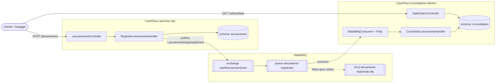

# CashFlow — Gestão de Fluxo de Caixa e Consolidação Diária

Desafio técnico: sistema para um lojista registrar lançamentos financeiros
(créditos/débitos) e consultar o saldo diário consolidado, com os dois
recursos desacoplados em serviços independentes.

## Arquitetura

Dois bounded contexts, cada um seu próprio processo, schema de banco e ciclo
de deploy — comunicação exclusivamente assíncrona via RabbitMQ, nunca chamada
HTTP síncrona entre eles:



- **`CashFlow.Launches.Api`** recebe e persiste lançamentos. Publica o
  evento e responde `201` **sem esperar** a consolidação processar
  (fire-and-forget) — continua funcionando normalmente mesmo com o Worker ou
  o RabbitMQ fora do ar.
- **`CashFlow.Consolidation.Worker`** consome a fila (retry exponencial +
  circuit breaker via Polly, dead-letter queue para mensagens que falham em
  todas as tentativas) e expõe a consulta de saldo — a leitura não depende do
  serviço de lançamentos estar de pé.

## Pré-requisitos

- [.NET 10 SDK](https://dotnet.microsoft.com/download)
- [Docker Desktop](https://www.docker.com/products/docker-desktop/) (Postgres
  + RabbitMQ via Compose; também usado pelos testes de integração via
  Testcontainers)

## Como rodar

```bash
# 1. Sobe Postgres e RabbitMQ
docker-compose up -d

# 2. Api de lançamentos (aplica migrations automaticamente no startup)
dotnet run --project src/CashFlow.Launches.Api

# 3. Worker de consolidação, em outro terminal (idem, migrations automáticas)
dotnet run --project src/CashFlow.Consolidation.Worker
```

Ou, pelo Visual Studio: botão direito na solução → **Configure Startup
Projects** → **Multiple startup projects** → `Action = Start` para
`CashFlow.Launches.Api` e `CashFlow.Consolidation.Worker`.

| Serviço | Swagger | Porta |
|---|---|---|
| `CashFlow.Launches.Api` | http://localhost:5226/swagger | 5226 (http) / 7261 (https) |
| `CashFlow.Consolidation.Worker` | http://localhost:5227/swagger | 5227 (http) / 7262 (https) |
| RabbitMQ management | http://localhost:15672 (usuário/senha: `cashflow`/`cashflow`) | 15672 |

Fluxos prontos também em
[`src/CashFlow.Launches.Api/CashFlow.Launches.Api.http`](src/CashFlow.Launches.Api/CashFlow.Launches.Api.http)
(registrar lançamento, casos inválidos, consultar saldo).

## Rodando os testes

```bash
dotnet test tests/CashFlow.Domain.Tests
dotnet test tests/CashFlow.Application.Tests
dotnet test tests/CashFlow.Integration.Tests   # sobe Postgres + RabbitMQ via Testcontainers, requer Docker
```

- **Domain.Tests / Application.Tests**: unitários, sem dependências externas.
- **Integration.Tests**: ponta a ponta com infraestrutura real efêmera —
  cobrem o fluxo completo (`POST /lancamentos` → fila → consolidação → `GET
  /saldos/{data}`), idempotência (mensagem duplicada) e o caminho de
  dead-letter queue.

## Decisões técnicas

**Dois serviços em vez de um monólito.** É requisito explícito (RNF01) que
falha total da consolidação não impeça o registro de lançamentos. Só é
possível garantir isso com processos e bancos separados — um monólito
compartilha o mesmo processo/pool de conexão, então uma falha de infraestrutura
de um lado facilmente derruba o outro junto.

**RabbitMQ em vez de Kafka.** Para o volume e o padrão de uso deste domínio
(processamento assíncrono simples, sem replay de eventos históricos nem
particionamento por alta escala), RabbitMQ entrega o necessário — retry,
dead-letter queue nativa, ack manual — com bem menos complexidade operacional
que Kafka, além de um painel de management pronto para inspeção visual da
fila durante a avaliação.

**`Mediator` (martinothamar) em vez de `MediatR`.** A partir das versões
recentes o MediatR passou a exigir licença comercial paga em produção — 
incompatível com um projeto sem orçamento de licenciamento. Trocado por uma
alternativa open-source (MIT) baseada em source generators, com API
equivalente.

**Idempotência via chave primária, não lock/checagem otimista.** A proteção
real contra reprocessar a mesma mensagem duas vezes (por exemplo, um retry do
Polly reentregando algo que já havia sido salvo) é a chave primária de
`lancamentos_processados.LancamentoId` — uma segunda inserção concorrente
falha por violação de PK. A checagem prévia (`LancamentoJaProcessadoAsync`)
evita trabalho desnecessário no caminho feliz, mas não é, sozinha, a garantia
de atomicidade.

**Toda decisão de negócio em `Application`/`Domain`, nunca em Controller ou
Infrastructure.** Os dois controllers apenas traduzem HTTP para comandos/
queries do Mediator. A orquestração de casos de uso (`RegistrarLancamentoHandler`,
`ConsolidarLancamentoHandler`) vive em `CashFlow.Application`; os
repositórios em Infrastructure só persistem o que o handler decidiu.

## Fora de escopo (deliberado)

- Autenticação/autorização
- Edição ou exclusão de lançamentos (lançamentos são imutáveis; correção seria
  um novo lançamento de estorno)
- Múltiplas moedas
- Interface visual — entrega é 100% API, demonstrada via Swagger e o arquivo
  `.http`

## Melhorias futuras

- **Autenticação/autorização** (JWT ou similar) nos dois serviços.
- **Outbox pattern real** na Api de lançamentos — hoje a publicação no
  RabbitMQ acontece logo após o `SaveChanges`, sem uma tabela de outbox
  transacional; uma falha entre o commit do lançamento e a publicação (não a
  indisponibilidade do RabbitMQ, já tratada) ainda pode, em tese, deixar um
  lançamento sem o evento correspondente.
- **Teste de carga** (k6 ou NBomber) validando concretamente a meta de 50
  req/s com até 5% de perda tolerada do RNF02 — hoje essa meta orienta o
  desenho (processamento assíncrono, Polly, prefetch), mas não foi medida.
- **Observabilidade**: tracing distribuído (OpenTelemetry) entre os dois
  serviços via RabbitMQ, métricas de fila/consumo.
- **Versionamento de API** (`/v1/...`) antes de qualquer evolução de contrato.
- **Estorno como lançamento de compensação**, já que edição/exclusão está
  fora de escopo.
- **CI** rodando build + os três projetos de teste a cada PR.
